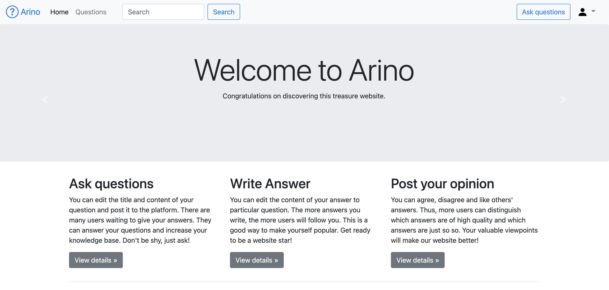
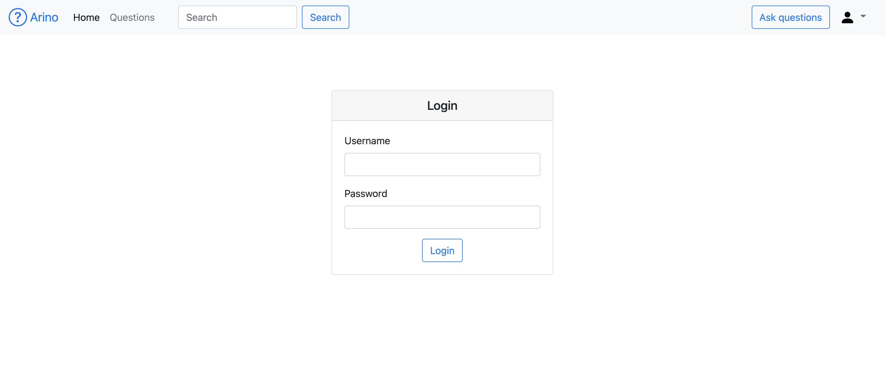
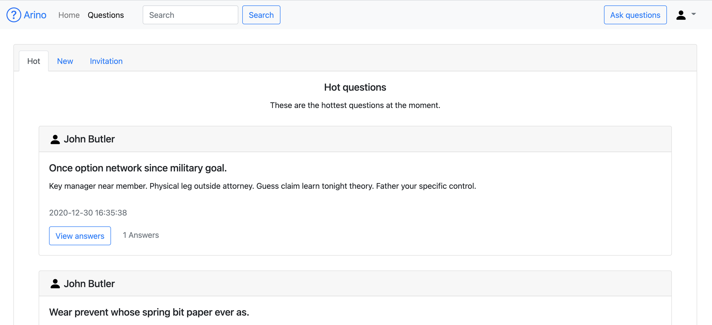
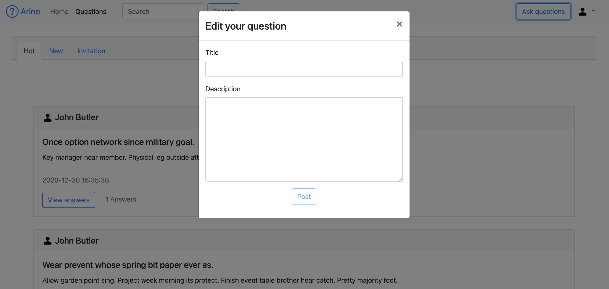
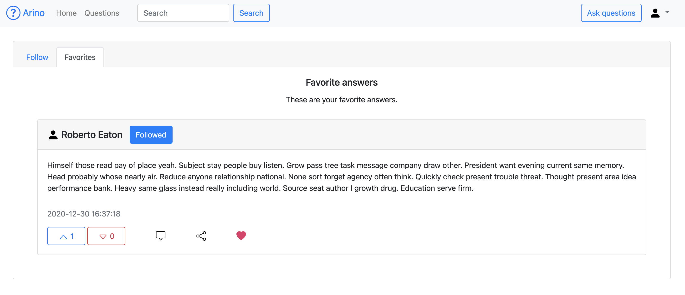
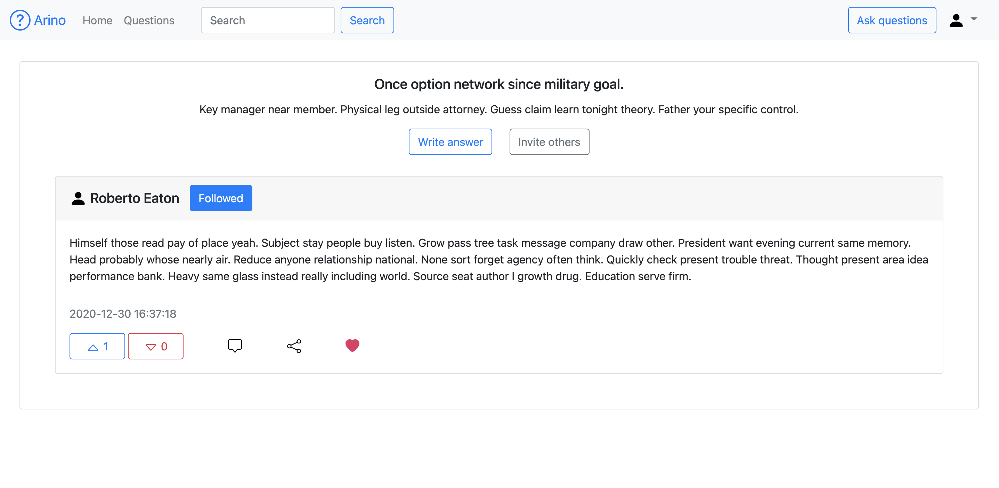

# 问答平台 - Question Platform

## 项目介绍

这是一个基于Flask框架+Jinja2模版引擎的网页问答平台，类似知乎和Quora

## Quick Start

```shell
# 在项目root目录下
$ pip install -r requirements.txt # 下载相关的Python依赖包
$ flask run # 运行Flask项目
```

## 项目技术栈

| 技术       | 说明           |
| ---------- | -------------- |
| Bootstrap  | 前端UI工具包   |
| Flask      | Python web框架 |
| SQLAlchemy | ORM框架        |
| Werkzeug   | 密码加密       |
| WTForms    | 表单验证       |
| Jinja2     | 模版引擎       |

## 主要功能

* 基本用户功能:
   * 登陆
   * 注册

* 围观用户提出的问题，分为三类
   * 热门问题
   * 最新问题
   * 你被邀请问答的问题

* 围观用户给出的回答，并且你可以进行如下操作
   * 同意
   * 反对
   * 评论
   * 分享
   * 收藏
   * 关注回答者
* 提出问题
* 写答案
* 邀请其他人回答
* 你可以在用户中心进行如下操作
   * 查看收藏的回答
   
   * 查看你关注的人的回答
   

## 项目效果图













